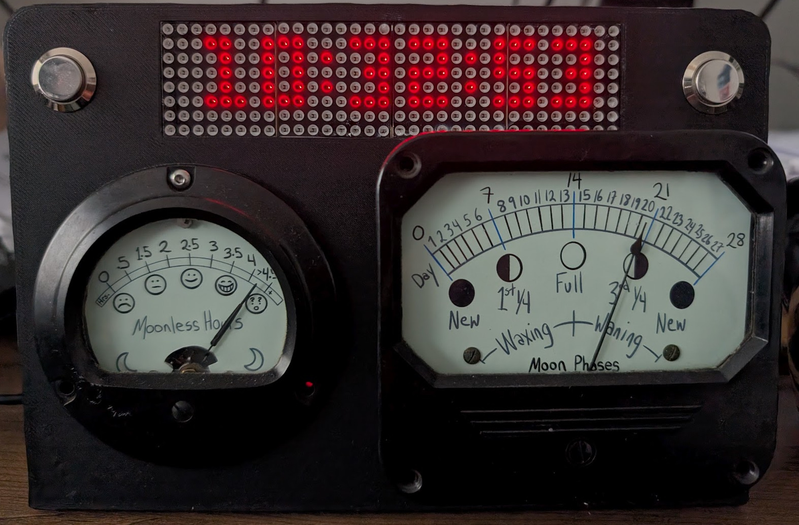

# MoonClock

A unique analog and digital clock that displays the current phase of the moon and the number of hours of darkness available for astronomical observation in the evening.

## Features

* **Analog Moon Phase Dial:** Visually represents the current lunar phase using a modified micro-ammeter.
* **Analog Darkness Hours Dial:** Indicates the duration of darkness in the evening after astronomical twilight, crucial for stargazing, using a modified micro-ammeter.
* **Digital Time Display:** A dot matrix display shows the current time.
* **Real-Time Clock (RTC):** Keeps accurate time, even when not powered.
* **3D Printed Frame:** The clock's frame is a single piece designed to be 3D printed.
* **Powered by Raspberry Pi RP2040:** Uses the WaveShare RP2040-Zero module for its easy to use form-factor.
* **CircuitPython Implementation:** The project is coded in CircuitPython, making it accessible and easy to modify.
* **Custom Astronomical Calculations:** Employs the `tcv_astro` module, specifically developed for this project using algorithms from astronomical literature (primarily "Astronomical Algorithms" by Jean Meeus).

## Hardware

* Raspberry Pi RP2040-based module (e.g., Waveshare RP2040-Zero)
* Real-Time Clock (RTC) module based on DS3231 (Rev 1) and MCP7940 (Rev 2)
* Dot matrix display based on MAX7219
* Modified micro-ammeters analog dials and associated DAC and amplifiers.
* 3D-printed frame (PETG)

## Software

* CircuitPython firmware for the Raspberry Pi RP2040
  * Custom build with Double Precision floating-point arithmetic enabled.
* `tcv_astro` CircuitPython module (containing astronomical calculation functions).
  * This module was written custom for this project to have very little dependencies.
* Libraries for controlling the RTC, dot matrix display, and the modified micro-ammeters (a lot of Adafruit CircuitPython libraries)

## `tcv_astro` Module

This project features a custom-built CircuitPython module, `tcv_astro`, which handles the necessary astronomical calculations. It implements algorithms described in Jean Meeus's "Astronomical Algorithms.":
  *  Meeus, J. (1991). Astronomical algorithms (1st ed.). Willmann-Bell.

This module computes:
* The current phase of the moon.
* Sunrise, sunset, moonset and moonrise times to determine the duration of evening darkness.

## Getting Started

Instructions for building and setting up your own MoonClock will be provided in future updates. This will include details on:

* 3D printing the frame.
* Modifying and wiring the micro-ammeters and other electronic components.
* Installing CircuitPython and necessary libraries.
* Uploading the code to the RP2040-Zero.

## Contributing

Contributions to this project are welcome! If you have ideas for improvements, bug fixes, or new features, please feel free to open an issue or submit a pull request.

## License

MIT license, see the LICENSE file.

## Acknowledgements

* The Raspberry Pi Foundation for the RP2040 microcontroller.
* The Afafruit CircuitPython community for their excellent libraries and support.
* Jean Meeus for his invaluable and authoritastive "Astronomical Algorithms" book

---